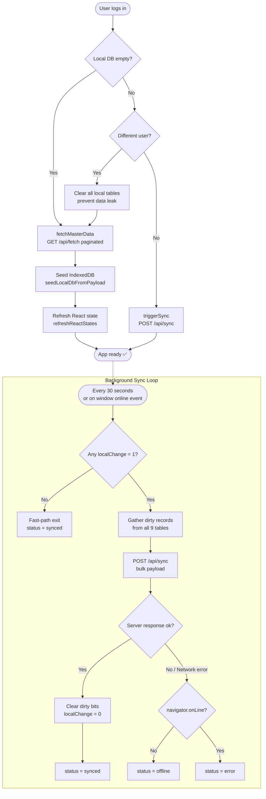

# 🔄 Data Sync Architecture — Floura

> How Floura keeps data consistent between the local IndexedDB (client) and the SQLite server (backend), even when offline.

---

## 📌 Overview

Floura uses an **offline-first, push-pull sync model**. All writes go to the local IndexedDB first, making every action instantaneous regardless of connectivity. In the background, a sync engine periodically detects local-only changes ("dirty records") and pushes them to the server. On login, the server's full dataset is pulled down to seed the local database.

**Key design principles:**
- ✅ **Offline-first** — All reads/writes hit IndexedDB; the UI never waits for the network
- ✅ **Dirty-bit tracking** — `localChange = 1` flags unsynced records; `0` means clean
- ✅ **Soft deletes** — Records are never physically deleted; `isDeleted = 1` marks deletion
- ✅ **Timestamp-wins conflict resolution** — Server only accepts a push if `updatedAt` is newer
- ✅ **User data isolation** — All server records are scoped by `user_email`
- ✅ **AES-256 encryption** — Sensitive fields are encrypted at rest on both client and server

---

## 🗺️ Sync Flow Diagram



---

## 📋 Sync Lifecycle — Step by Step

### 1. 🔐 Login & User Switch Detection

**File:** [`src/App.tsx`](file:///Users/praveen/antigravity/floura/src/App.tsx#L244-L306)

When the authenticated user's email changes:

1. Read `patisserie_last_synced_email` from IndexedDB preferences.
2. If a **different user** is logging in → **wipe all 9 local tables** to prevent cross-user data leakage.
3. Save the new email to preferences.
4. Count existing local records:
   - If `customers = 0` AND `orders = 0` → **Initial Load** (`fetchMasterData`)
   - Otherwise → **Background Sync** (`triggerSync`)
5. If offline → set `syncStatus = "offline"`.

---

### 2. 📥 Initial Load (First Login / New Device)

**Function:** `fetchMasterData()` → **`GET /api/fetch?page=N&limit=500`**

**File:** [`src/App.tsx`](file:///Users/praveen/antigravity/floura/src/App.tsx#L331-L417)

Runs with a progress indicator via `InitialSyncLoader`. Steps:

| Step | Action |
|---|---|
| 1 | Show `InitialSyncLoader` with progress bar |
| 2 | Clear all local tables (clean slate) |
| 3 | Paginated `GET /api/fetch` — fetches 500 records per page |
| 4 | Each page result is seeded into IndexedDB via `seedLocalDbFromPayload()` |
| 5 | Customers & Orders paginate; other tables (inventory, recipes, etc.) only loaded on page 1 |
| 6 | `refreshReactStates()` called once — loads reactive data slice into React state |
| 7 | `syncStatus` → `"synced"` |

```
Progress: 10% → 20% → 25–85% (per page) → 90% → 100%
```

---

### 3. 📤 Ongoing Push Sync (Background)

**Function:** `triggerSync()` → **`POST /api/sync`**

**File:** [`src/App.tsx`](file:///Users/praveen/antigravity/floura/src/App.tsx#L419-L544)

Triggered by:
- ⏱ **Periodic timer** — every **30 seconds** while online and user is logged in
- 🌐 **Network reconnect** — `window.addEventListener("online", ...)`
- ✏️ **After any write** — most data-mutating hooks call `triggerSync()` post-save

#### Step-by-step:

**Step 1 — Guard: prevent double-sync**
```
if (isSyncingRef.current) { syncQueueRef.current = true; return; }
```
A mutex (`isSyncingRef`) prevents concurrent syncs. If a sync is in flight, the incoming request sets a queue flag and retries once the current sync finishes.

**Step 2 — Gather dirty records**

Query all 9 IndexedDB tables in parallel for records where `localChange = 1`:
```ts
localDb.customers.where("localChange").equals(1).toArray()
// ... same for orders, inventory, recipes, checklist,
//     customEvents, dispatchedNotifications, scheduledAlerts, bakeryProfile
```

**Step 3 — Fast-path exit**

If no dirty records exist across all tables → immediately set `syncStatus = "synced"` and return. No network call made.

**Step 4 — POST /api/sync**

Send a single bulk JSON payload to the server:
```json
{
  "userEmail": "user@example.com",
  "customers": [...dirty customers],
  "orders": [...dirty orders],
  "inventory": [...],
  "recipes": [...],
  "checklist": [...],
  "customEvents": [...],
  "dispatchedNotifications": [...],
  "scheduledAlerts": [...],
  "bakeryProfile": [...]
}
```

**Step 5 — Clear dirty bits on success**

After server confirms `status: "success"`, a single IndexedDB transaction clears `localChange → 0` for every successfully synced record:
```ts
localDb.customers.update(c.id, { localChange: 0 })
// ... same for all tables
```

---

### 4. 🖥️ Server: Receiving a Sync (`POST /api/sync`)

**File:** [`server.ts`](file:///Users/praveen/antigravity/floura/server.ts#L835-L1070)

The server processes the bulk sync payload atomically inside a **SQLite transaction** (`BEGIN TRANSACTION` / `COMMIT` / `ROLLBACK`).

For each record in each table, the server uses **`INSERT OR UPDATE` (UPSERT)** with a timestamp guard:

```sql
INSERT INTO customers (id, name, ..., updatedAt, user_email, isDeleted)
VALUES (...)
ON CONFLICT(id) DO UPDATE SET
  name=excluded.name, ...
WHERE excluded.updatedAt > customers.updatedAt
   OR customers.updatedAt IS NULL
```

> **Conflict rule:** The server only overwrites an existing record if the incoming `updatedAt` is **strictly newer**. This prevents stale client pushes from overwriting fresher server state.

Before writing, all sensitive fields are **encrypted** on the server via `encryptRow()`:
- Fields like `name`, `mobile`, `customerName`, `messageText`, etc. are AES-256 encrypted with prefix `__ENC__`.

---

### 5. 📡 Server: Serving Master Data (`GET /api/fetch`)

**File:** [`server.ts`](file:///Users/praveen/antigravity/floura/server.ts#L1073)

Serves paginated records filtered strictly by `user_email`. All records are **decrypted** before sending via `decryptRow()`. Response shape:

```json
{
  "status": "success",
  "customers": [...],
  "orders": [...],
  "inventory": [...],
  "recipes": [...],
  "checklist": [...],
  "customEvents": [...],
  "dispatchedNotifications": [...],
  "scheduledAlerts": [...],
  "bakeryProfile": [...],
  "hasMore": false,
  "syncTime": "2026-08-13T04:00:00.000Z"
}
```

---

## 🗂️ Tables Covered by Sync

| Table | IndexedDB Name | SQLite Name | Conflict Key |
|---|---|---|---|
| Customers | `customers` | `customers` | `updatedAt` |
| Orders | `orders` | `orders` | `updatedAt` |
| Inventory | `inventory` | `inventory` | `updatedAt` |
| Recipes | `recipes` | `recipes` | `updatedAt` |
| Checklist | `checklist` | `checklist` | `updatedAt` |
| Custom Events | `customEvents` | `custom_events` | `createdAt` |
| Dispatched Notifications | `dispatchedNotifications` | `dispatched_notifications` | `dispatchedAt` |
| Scheduled Alerts | `scheduledAlerts` | `scheduled_alerts` | `createdAt` |
| Bakery Profile | `bakeryProfile` | `bakery_profile` | `updatedAt` |

---

## 🔒 Encryption

Data is encrypted at two levels:

### Client (IndexedDB) — [`src/db.ts`](file:///Users/praveen/antigravity/floura/src/db.ts)
- Dexie table hooks (`creating`, `updating`, `reading`) transparently encrypt/decrypt **entire records** using `CryptoJS.AES`.
- Only `id`, `localChange`, and `isDeleted` are stored in plaintext (needed for IndexedDB indexes).
- The rest is stored as a single `encryptedData` blob.

### Server (SQLite) — [`server.ts`](file:///Users/praveen/antigravity/floura/server.ts)
- Individual sensitive fields are encrypted column-by-column using `encryptRow()` / `decryptRow()`.
- Encrypted values are prefixed with `__ENC__` for detection.
- Fields encrypted: `name`, `mobile`, `customerName`, `customerMobile`, `eventType`, `venueAddress`, `cakeShape`, `cakeWeight`, `cakeFlavor`, `preference`, `layers`, `cakeInscription`, `referenceImage`, `specialInstructions`, `paymentStatus`, `paymentHistory`, `supplier`, `unit`, `ingredients`, `imageUrl`, `text`, `title`, `notes`, `messageText`, `bakeryName`, `email`, `phone`, `address`, `role`, `currency`, `dateFormat`.

---

## 🔄 Sync Status State Machine

```
             login / reconnect / 30s timer
                       │
                       ▼
              ┌────────────────┐
              │    syncing     │◄──────────────┐
              └──────┬─────────┘               │
                     │                         │
          ┌──────────┴─────────┐               │
          │                    │               │
    server OK             server fail          │
          │                    │               │
          ▼                    ▼               │
      ┌────────┐         ┌───────────────┐     │
      │ synced │         │ online? error │     │
      └────────┘         │ offline? offl │     │
                         └───────────────┘     │
                                │              │
                          reconnect ───────────┘
```

| Status | Meaning |
|---|---|
| `synced` | All local records are clean; server is up to date |
| `syncing` | Sync is actively in flight |
| `offline` | Network unavailable; app fully works locally |
| `error` | Network available but sync request failed |

---

## ⚙️ API Endpoints

| Method | Endpoint | Auth | Purpose |
|---|---|---|---|
| `GET` | `/api/fetch` | ✅ Bearer token | Pull all server records (paginated, scoped by user) |
| `POST` | `/api/sync` | ✅ Bearer token | Push all dirty local records to server |
| `GET` | `/api/auth/verify` | ✅ Bearer token | Validate auth session |

---

## 🧩 Key Files Reference

| File | Role |
|---|---|
| [`src/App.tsx`](file:///Users/praveen/antigravity/floura/src/App.tsx) | `triggerSync()`, `fetchMasterData()`, sync state, user-switch logic |
| [`src/db.ts`](file:///Users/praveen/antigravity/floura/src/db.ts) | Dexie schema, `localChange` dirty-bit, AES hooks, `seedLocalDbFromPayload()` |
| [`server.ts`](file:///Users/praveen/antigravity/floura/server.ts) | `POST /api/sync`, `GET /api/fetch`, SQLite UPSERT, `encryptRow()` / `decryptRow()` |
| [`src/components/InitialSyncLoader.tsx`](file:///Users/praveen/antigravity/floura/src/components/InitialSyncLoader.tsx) | Progress UI shown during first-time data fetch |

---

## ❓ FAQ / Edge Cases

**Q: What happens if the device goes offline mid-sync?**
> The `triggerSync()` catch block detects `!navigator.onLine` and sets `syncStatus = "offline"`. The dirty bits remain `localChange = 1`, so the next reconnect event triggers a retry automatically.

**Q: What if two devices edit the same record simultaneously?**
> The server uses timestamp-wins: `WHERE excluded.updatedAt > existing.updatedAt`. Whichever device syncs last with a newer timestamp wins. The other device's change will be silently ignored on the next push.

**Q: Are deleted records actually removed?**
> No. All deletions set `isDeleted = 1` (soft delete). Records are filtered out in UI queries but remain in both IndexedDB and SQLite permanently, preserving audit trail and allowing future recovery.

**Q: Can a sync run while another is in progress?**
> No. `isSyncingRef` (a React ref mutex) prevents concurrent sync runs. If a second sync is requested while one is running, `syncQueueRef` is set to `true`, and a single retry fires 100ms after the first sync completes.

**Q: What prevents User A from seeing User B's data?**
> Every server record has a `user_email` column. The `requireAuth` middleware extracts the verified email from the Firebase token and the `/api/fetch` query filters with `WHERE user_email = ?`. No cross-user leakage is possible at the API level. On the client, the user-switch guard clears all local tables when the email changes.

---

*Last updated: August 2026*
